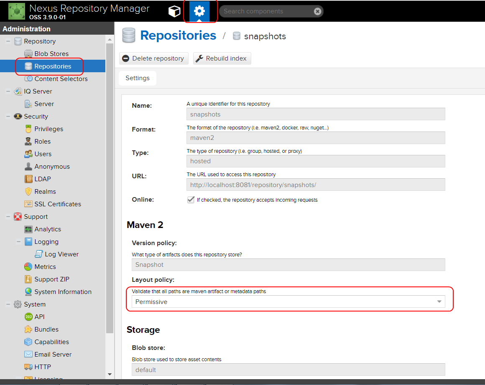
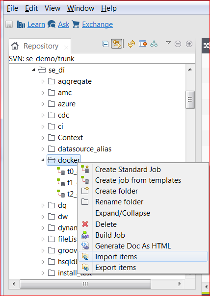
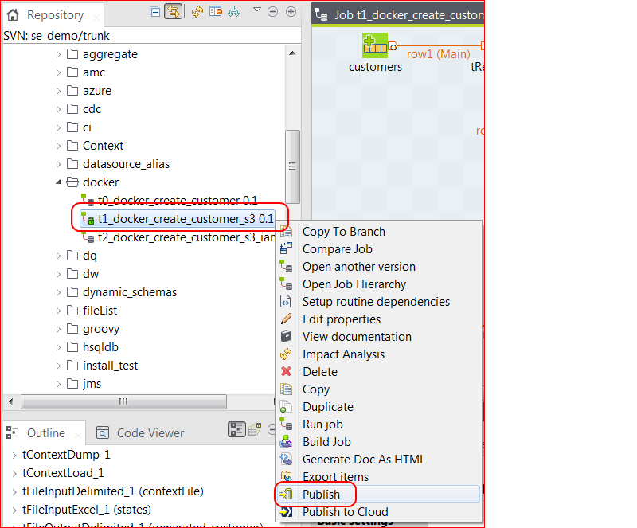
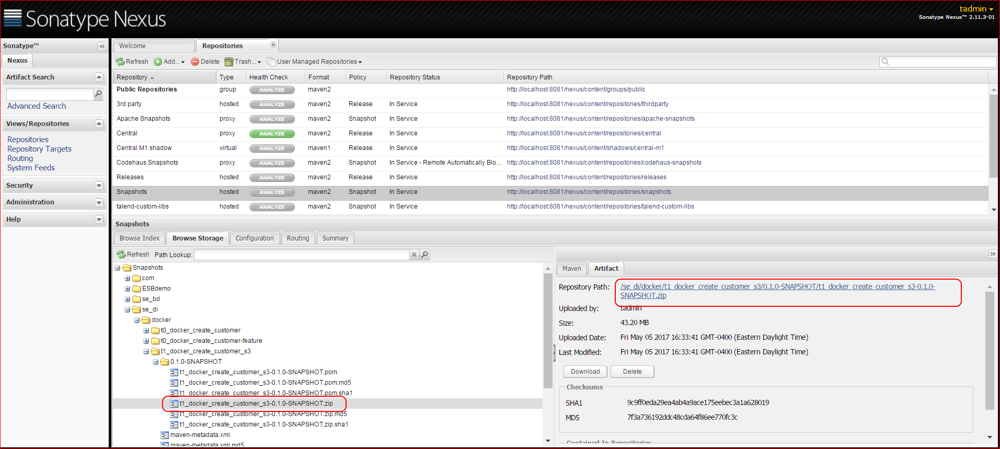

# Talend Docker Example

This repository includes sample bash scripts which allow you to deploy Talend jobs to Docker containers.

Two methods are supported.  The `job2docker` approach converts a single Talend job zip file to a container.
The resulting Docker image will have a single entry point for the job.
It is intended for use by developers during their build / test / debug cycle and provides desktop parity.

The second manifest based approach reads a file with links to one or more Talend jobs to create a docker image.
All jobs in the manifest must have been published to your Talend Nexus repository.
The resulting Docker image requires users to provide the Docker CMD to run the desired job.

* [Pre-requisites](#pre-requisites)
* [Environment](#environment)
* [Directory Index](#directory-index)
* [Design Overview](#design-overview)
    * [Job2Docker Design](#job2docker-design)
    * [Manifest Design](#manifest-design)
* [Setup](#setup)
* [Getting Started](#getting-started)
    * [HelloWorld with Job2Docker](#helloworld-with-job2docker)
* [Sample Jobs](#sample-jobs)
    * [Configuration](#configuration)
    * [Running the Sample Jobs in Docker](#running-the-sample-jobs-in-docker)
    * [Running the Sample Jobs in AWS](#running-the-sample-jobs-in-aws)
    * [Running the Sample Jobs in Azure](#running-the-sample-jobs-in-azure)
    * [Sample Job Design](#sample-job-design)


### Pre-Requisites

* [Docker](https://docs.docker.com/install/linux/docker-ce/centos/)
* [Oracle JRE](http://www.oracle.com/technetwork/java/javase/downloads/index.html)
* [Talend Studio](https://info.talend.com/request-talend-data-integration.html)
* Talend Artifact Repository for the manifest based approach requires Talend enterprise subscription
* Bash 4.3 - supporting scripts use a nameref feature


### Environment

* All containerization work is done on Linux with Docker installed.
* Talend Studio steps can run on a separate machine if desired, it could be a Windows machine.
* For the manifest based approach Both Linux and Studio machines need access to a Nexus instance provided with a Talend enterprise subscription.
* For the job2docker approach, a common drop point (shared directory, shared network drive, shared folder) for Jobs built from Studio for the job2docker approach.

* The environment used to test these scripts was a Windows laptop running Studio and Nexus.
* The docker script were run on an Ubuntu VM running on the same Windows laptop.
* VirtualBox was used for the VM hosting.
* A shared folder was created using VirtualBox so that Studio builds would be visible to the Linux VM.


### Directory Index

* bin - scripts for creating docker images, creating containers, and deploying images to the cloud
* job2docker - working directory for running the agent that monitors the build directory for Talend zip files
* job2docker_build - sample Dockerfile used to create Docker image containing the Talend job
* manifest_build - docker build artifacts for manifest based build
* pictures - jpg files used in this readme
* sample_job - scripts for step-by-step walkthrough
* util - utility bash scripts


### Setup

#### Install Docker

Install Docker for your host OS

* [Install Docker on Centos](https://docs.docker.com/install/linux/docker-ce/centos/)
* [Install Docker on Debian](https://docs.docker.com/install/linux/docker-ce/debian/)
* [Install Docker on Fedora](https://docs.docker.com/install/linux/docker-ce/fedora/)
* [Install Docker on Ubuntu](https://docs.docker.com/install/linux/docker-ce/ubuntu/)

For AWS Linux

````
sudo yum update -y
sudo yum install -y docker
sudo service docker start
````

Optional - Follow the [Linux post-installation steps](https://docs.docker.com/install/linux/linux-postinstall/) for Docker to create a Docker user group.  This is required for the job2docker process to be able to invoke Docker without sudo.
Note that this grants root equivalent privileges to the account so it must be used with care.


````bash
sudo groupadd docker
sudo usermod -aG docker $USER
# logout and log back in so the settings take effect
````

Test that docker is running
````bash
docker run hello-world
````

#### Download Scripts

Use git clone to download this repository.

````bash
git clone https://github.com/EdwardOst/talend_distro.git
cd talend_distro
git submodule update --init --recursive
````

Note that you need to also initialize the submodules which include utility scripts.
Other job2docker scripts are in the bin directory.
Build scripts for Dockerfile are in job2docker_build and manifest_build.

#### Create a Shared Directory

This step is only required for job2docker mode.

If you are running Studio on Linux then just create a directory that will be used as the target for Studio builds.

If you are running Studio on Windows, then either use either a network share common to both Linux and Windows machines or [create a Shared folder](https://www.youtube.com/watch?v=89HDKvTfR$).  You will build your jobs from Studio to this directory and it will be monitored by the job2docker utililty.

#### Job2Docker Listener

The job2docker_listener is just a Talend job that listens on a directory and kicks off the bash scripts found in this git repo.
The `job2docker_listener_0.1.zip` file is in the jobs directory.  It contains the already built job.
Unzip this to a folder and then modify the context variables as shown in the steps below.
Create a parent directory for this job since Talend zip files are not grouped under a parent directory by default.
The multiple redundant names can be a bit confusing, so use an abbreviated name for the top level.

````bash
cd $HOME
mkdir j2d
cd j2d
unzip ${HOME}/talend_distro/jobs/job2docker_listener_0.1.zip
````

Edit the `Default.properties` file to point to your own directory paths.

````bash
cd job2docker_listener/se_demo/job2docker_listener_0_1/contexts
nano -w Default.properties
````

````
#this is context properties
#Wed Jun 20 04:00:15 EDT 2018
job_publish_directory=/home/eost/shared/published_jobs
job_zip_target_dir=/home/eost/containerized
working_dir=
package_command=/home/eost/talend_distro/bin/job2docker
build_command=/home/eost/talend_distro/job2docker_build/build
deploy_command=/home/eost/talend_distro/bin/deploy-aws
job_owner=eost
````

In the example above the `job_publish_directory` is the shared directory being monitored by the job2docker_listener job.

The `working_dir` can be left blank.  The scripts will use a temporary directory.

Change the package, build, and deploy paths to point to where you cloned this repo.

You need to create The `job_zip_target_dir`.  It is a working directory that will hold the modified job tgz file.

````bash
mkdir -p /home/eost/containerized
````

You will also need to set the execute permission on the shell script to start the job.

````bash
cd ${HOME}/j2d/job2docker_listener
chmod +x job2docker_listener_run.sh
./job2docker_listener_run.sh
````

Start the job2docker_listener process

````
eost@ubuntu:~/talend_distro/j2d/job2docker_listener$ ./job2docker_listener_run.sh
log4j:ERROR Could not connect to remote log4j server at [localhost]. We will try again later.
Listening on /home/eost/shared/published_jobs
````

You should see output similar to this [job2docker listener console capture](docs/job2docker_listener_console_sample.log)


### Getting Started

* [Job2Docker Design Overview](docs/job2docker-design-overview.md)
* [Job2Docker HelloWorld](docs/job2docker-hello-world.md)
* [Job2Docker HelloWorld Config Files](docs/job2docker-hello-world-config-files.md)

#### Passing Parameters with Implicit Context Load from Database

This step requires a database that is accessible from the Docker container.

1.  Create database tables to hold parameters
2.  Populate database with sample parameters
3.  Modify HelloWorld to use implicit context load from database
4.  Test HelloWorld in Studio
5.  Rebuild HelloWorld image
6.  Run helloworld job with parameter group id

#### Separating Configuration from Parameters

1.  Create database tables to hold configuration
2.  Populate database with sample configuration
3.  Modify HelloWorld to use impllicit context load for both parameters and configuration
4.  Test HelloWorld in Studio
5.  Rebuild HelloWorld image
6.  Run helloworld job with parameter group id

#### HelloWorld with Manifest

1.  Modify Nexus to accept non-maven artifacts
2.  Publish Helloworld to Nexus from Studio
3.  Modify manifest
4.  Run package command
5.  Run build command
6.  Run helloworld job container
7.  Run helloworld job container with context parameters


Note that you have to provide the path to the Talend launch script as the CMD parameter with the manifest style.

````
docker run eost/docker_hello_world:0.1.0 /talend/docker_hello_world/docker_hello_world/docker_hello_world_run.sh
log4j:ERROR Could not connect to remote log4j server at [localhost]. We will try again later.
hello world
````

You append regular Talennd commandline syntax to set context variables.

````
docker run eost/docker_hello_world:0.1.0 /talend/docker_hello_world/docker_hello_world/docker_hello_world_run.sh --context_param "message=Greetings earthling"
log4j:ERROR Could not connect to remote log4j server at [localhost]. We will try again later.
Greetings earthling
````

### Sample Jobs

(work in progress)

Slightly more advanced sample jobs are provided in the sample_job/jobs directory.
The sample jobs are used to illustrate the use of some basic Docker practices like creating immutable containers.
The sample jobs are also set up to run in a Cloud environment so they use Cloud storage.
As a result, additional steps are required to configure Cloud credentials.
When jobs are run in the Cloud, the container can inherit permissions from the hosting EC2 instance.
But when run locally things need to be configured.  So this adds some complexity.

* t0_docker_create_customer
* t1_docker_create_customer_aws
* (tbd) t2_docker_create_customer_az
* t3_docker_tmap_customer
* (tbd) t4_docker_tmap_customer_aws
* (tbd) t5_docker_tmap_customer_az

### Configuration

Configuration is externalized outside the SCM directory tree.

Run the following command

````bash
sample_jobs/setup/init
````

This will initialize `TALEND_DOCKER_HOME` in `${HOME}/talend/docker` as the root of your work area.
It will be populated with default config files for the sample jobs.

````
${HOME}/talend
└── docker
    ├── config
    │   └── global.cfg
    ├── SE_DEMO
    │   ├── config
    │   │   └── project.cfg
    │   └── talend_sample_container_app
    │       ├── in
    │       │   └── states.csv
    │       ├── t0_docker_create_customer
    │       │   └── config
    │       │       └── job.cfg
    │       ├── t0_docker_create_customer_s3
    │       │   └── config
    │       │       └── job.cfg
    │       └── t3_docker_tmap_customers
    │           └── config
    │               └── job.cfg
    └── talend-docker.env
````

Edit the `docker/config/global.cfg` file with your AWS access and secret key.
The file permissions should already be limited to -rw for the current user, but doublechck.

The scripts for building docker images publish files to Nexus which do not conform to the strict maven filename conventions.
Set the Nexus 3 Layout policy to permissive for the Snapshots repository.




### Running the Sample Jobs in Docker

1.  Import the sample job found in the `sample_job/jobs` directory into Talend Studio. 
2.  Select Publish Job from the Talend Studio to create a Talend job zip file.
3.  Create a manifest file for use by the Talend container packager.
5.  Invoke the packager.
6.  Invoke the build script to create the Talend Docker image.
7.  Invoke the run script to create and execute a container.

Import the `t0_docker_create_customer.zip` sample job from `sample_job/jobs` directory.



Publish the job to Nexus by right clicking and using the context menu in Talend Studio.



Get the URL of your published zip file from Nexus.



Now go to the `sample_job` directory and edit the `job_manifest.cfg` file.
It should have one entry in it which is the url of your published job.
Edit the url if necessary to reflect the url you got from Nexus.  Save the file.

Repeat this process for any sample jobs of interest.  Remove or comment out other manifest entries.

You should still be in the `sample_job` directory.
Run the `d01-package` script.  It is a symbolic link to a script in the /bin directory.
This should retrieve the published job zip file from Nexus, unzip, modify it, and compress in tgz format before publishing it back to Nexus.
 
You should still be in the `sample_job` directory.
Run the `d02-build` script.  It is a symbolic link to a script in the image subdirectory.
This should create a docker image in the local docker registry.

The Dockerfile inherits the `anapsix` base image which is already populated with Oracle JDK.
It then downloads the packaged Talend jobs from Nexus and uzips it.
It copies a lookup table needed to the `/talend/in directory`.
Strictly speaking, the lookup table is not needed since the run command below mounts a host directory over the container `/talend/in` directory.
You could just copy the lookup table to the host directory.
But it is included in the example so that the example can run independently in the Cloud without any extra parameters in your ECS Task definition.
The default image tag will use your linux user name.  You may wish to change this if you are logged in as root, but it is not required.

#### Running the Sample Jobs in AWS

The job itself also writes to S3.  
This means you need to provide your S3 credentials via Context variables.
Since Context variables in Job are not secure, the job uses tContextLoad to read the Context Variables from the `~/in/context.txt` file.
This file does not exist in github since it is sensitive, so you will need to create it.

Edit the `~/in/context.txt` file as shown below.

    connection_awss3_secret_key=your_s3_secret
    connection_awss3_access_key=your_s3_access_key

You are now ready to launch the container.  Still in the `sample_job` directory, invoke the `run` script.  This script uses the Docker `run` command along with Docker volumes to mount host directories in the container.

When you run the container the Talend Job will run as PID 1.  When the Talend Job is finished running it will end and the container will shut down.

If you do not wish to write to S3 then just edit the sample job.

#### Running the Sample Jobs in Azure

#### Sample Job Design

The sample jobs attempt to illustrate some common practices in using Docker volumes to support immutable containers for different runtime aspects.
Different volumes are used to provision and isolate data used by the containerized job.

* job-root/config (ro) – configuration files common to all job instances
* job-instance/config (ro) – configuration files specific to this job instance
* in (ro) - input data
* data (rw) – data required by the container, survives restarts
* log (w) – log files
* amc (w) - activity monitor console log files
* out (rw) - output data
* temp (rw) – transient and can always be deleted prior to the container (re)start

The volume mounts are addressed when launching containers with the Docker Run command rather than in the Docker Image build.
As a result, this has no impact on the Manifest or job2docker approach.  It a container issue rather than an image issue.

The sample jobs include a custom run script which attaches these volumes to host files so that the resulting output is visible.

The sample jobs use volumes for sensitive data.  While it separated from less sensitive configuraiton data, this is not best practice.
A preferred approach would be to use [Kubernetes Service Catalog](https://kubernetes.io/docs/concepts/service-catalog/)

