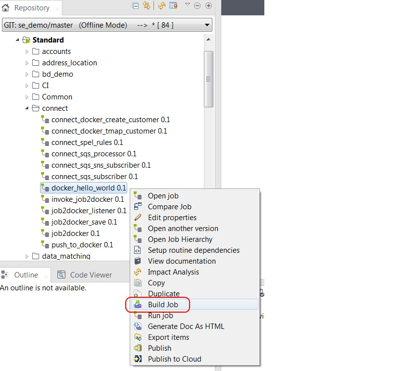

# HelloWorld with Job2Docker

1.  [Build helloworld job to shared directory](#build-docker-job)
2.  [Run helloworld job container](#run-job-in-container)
3.  [Run helloworld job container with context parameters](#run-parameterized-job-in-container)


# Build Docker Job

The jobs directory also includes a simple HelloWorld job.
Both the exported job and the built job are included for reference.
Use the `Import Items` capability to load `docker_hello_world.zip` into Studio.


Use `Build Job` to generate the zip file in the shared directory previously created.



Confirm that the docker image has been built

````
sudo docker images

REPOSITORY                                          TAG                 IMAGE ID            CREATED              SIZE
eost/docker_hello_world                             0.1                 ce044e5cbcb7        About a minute ago   176MB
````

You should see output similar to the extract below in the job2docker_listener console

````
eost@ubuntu:~/talend_distro/j2d/job2docker_listener$ ./job2docker_listener_run.sh
log4j:ERROR Could not connect to remote log4j server at [localhost]. We will try again later.
Listening on /home/eost/shared/published_jobs
.---------------------------------------------------------------------------------.
|                            #1. tLogRow_6--tLogRow_6                             |
+-------------------+-------------------------------------------------------------+
| key               | value                                                       |
+-------------------+-------------------------------------------------------------+
| current_iteration | 8                                                           |
| fileName          | docker_hello_world_0.1.zip                                  |
| presentFile       | null                                                        |
| createdFile       | null                                                        |
| updatedFile       | /home/eost/shared/published_jobs/docker_hello_world_0.1.zip |
| deletedFile       | null                                                        |
+-------------------+-------------------------------------------------------------+

.----------------------------------------------------------------------------.
|                     #1. tLogRow_1--job2docker_listener                     |
+--------------+-------------------------------------------------------------+
| key          | value                                                       |
+--------------+-------------------------------------------------------------+
| job_zip_path | /home/eost/shared/published_jobs/docker_hello_world_0.1.zip |
+--------------+-------------------------------------------------------------+

.------------------+-----------------------------------------------------------.
|                               job2docker_start                               |
|=-----------------+----------------------------------------------------------=|
|key               |value                                                      |
|=-----------------+----------------------------------------------------------=|
|job_zip_path      |/home/eost/shared/published_jobs/docker_hello_world_0.1.zip|
|job_zip_target_dir|/home/eost/containerized                                   |
|package_command   |/home/eost/talend_distro/bin/job2docker                    |
|shell_log_file    |/home/eost/talend_distro/job2docker.log                    |
|working_dir       |                                                           |
|job_owner         |eost                                                       |
|deploy_command    |/home/eost/talend_distro/bin/deploy-aws                    |
|build_command     |/home/eost/talend_distro/job2docker_build/build            |
'------------------+-----------------------------------------------------------'

job_filename=docker_hello_world_0.1.zip
job_name=docker_hello_world
job_version=0.1
DEBUG: job_to_docker main : job_zip_path=/home/eost/shared/published_jobs/docker_hello_world_0.1.zip
DEBUG: job_to_docker main : job_zip_target_dir=/home/eost/containerized
DEBUG: job_to_docker main : working_dir=
DEBUG: job_to_docker main : tmp_working_dir=/home/eost/tmp/job2docker/hfaiOk
INFO: Copying '/home/eost/shared/published_jobs/docker_hello_world_0.1.zip' to working directory '/home/eost/tmp/job2docker                                                                  /hfaiOk' : job_to_docker main
DEBUG: process_zip job_to_docker main : working_dir=/home/eost/tmp/job2docker/hfaiOk
DEBUG: process_zip job_to_docker main : job_file_name=docker_hello_world_0.1.zip
DEBUG: process_zip job_to_docker main : job_file_root=docker_hello_world_0.1
DEBUG: process_zip job_to_docker main : job_root=docker_hello_world
DEBUG: process_zip job_to_docker main : is_multi_job=false
INFO: Unzipping '/home/eost/tmp/job2docker/hfaiOk/docker_hello_world_0.1.zip' to '/home/eost/tmp/job2docker/hfaiOk/docker_h                                                                  ello_world_0.1' : process_zip job_to_docker main
DEBUG: process_zip job_to_docker main : rename 'jobInfo.properties' to 'jobInfo_docker_hello_world.properties'
DEBUG: process_zip job_to_docker main : rename 'routines.jar' to 'routines_docker_hello_world.jar'
DEBUG: process_zip job_to_docker main : tweak shell script to use 'routines_docker_hello_world.jar'
DEBUG: process_zip job_to_docker main : insert exec at beginning of java invocation
DEBUG: process_zip job_to_docker main : set exec permission since it is not set and is not maintianed by zip format
INFO: Dockerized zip file ready in '/home/eost/containerized/docker_hello_world.tgz' : job_to_docker main
INFO: Finished : main
[tLogRow_2] ~/talend_distro/job2docker_build ~/talend_distro/j2d/job2docker_listener
[tLogRow_2] INFO: main : job_owner=eost
[tLogRow_2] INFO: main : job_name=docker_hello_world
[tLogRow_2] INFO: main : job_version=0.1
[tLogRow_2] INFO: main : job_tgz_file=/home/eost/containerized/docker_hello_world.tgz
[tLogRow_2] INFO: main : job_parent_dir=/talend
[tLogRow_2] INFO: main : image_tag=eost/docker_hello_world:0.1
[tLogRow_2] Sending build context to Docker daemon  1.466MB
[tLogRow_2]
[tLogRow_2] Step 1/10 : FROM anapsix/alpine-java:8u121b13_jdk
[tLogRow_2]  ---> 2d0accb0e2f8
[tLogRow_2] Step 2/10 : MAINTAINER Ed Ost eost@talend.com
[tLogRow_2]  ---> Running in 76ada276654f
[tLogRow_2]  ---> 2c770cabfc73
[tLogRow_2] Removing intermediate container 76ada276654f
[tLogRow_2] Step 3/10 : ARG job_name
[tLogRow_2]  ---> Running in 8e462d014dff
[tLogRow_2]  ---> a0508690fa39
[tLogRow_2] Removing intermediate container 8e462d014dff
[tLogRow_2] Step 4/10 : ARG job_version
[tLogRow_2]  ---> Running in bbe2e17266dd
[tLogRow_2]  ---> 32d6ccee4942
[tLogRow_2] Removing intermediate container bbe2e17266dd
[tLogRow_2] Step 5/10 : ARG job_tgz_file
[tLogRow_2]  ---> Running in b8af84f01a88
[tLogRow_2]  ---> d79a40b1b797
[tLogRow_2] Removing intermediate container b8af84f01a88
[tLogRow_2] Step 6/10 : ARG job_parent_dir=/talend
[tLogRow_2]  ---> Running in f4a1bcec948a
[tLogRow_2]  ---> aff4e2917fec
[tLogRow_2] Removing intermediate container f4a1bcec948a
[tLogRow_2] Step 7/10 : ENV JOB_NAME ${job_name} JOB_VERSION ${job_version} JOB_PARENT_DIR ${job_parent_dir}
[tLogRow_2]  ---> Running in 0a43118a74d9
[tLogRow_2]  ---> 2a7ef3cd30e9
[tLogRow_2] Removing intermediate container 0a43118a74d9
[tLogRow_2] Step 8/10 : ADD "${job_tgz_file}" "${job_parent_dir}/"
[tLogRow_2]  ---> e0c438ffd10e
[tLogRow_2] Removing intermediate container 4793e15b51ef
[tLogRow_2] Step 9/10 : RUN mkdir -p /talend/config
[tLogRow_2]  ---> Running in 6b98b867d536
[tLogRow_2]  ---> bf0e399c339a
[tLogRow_2] Removing intermediate container 6b98b867d536
[tLogRow_2] Step 10/10 : ENTRYPOINT /bin/ash /talend/docker_hello_world_0.1/docker_hello_world/docker_hello_world_run.sh
[tLogRow_2]  ---> Running in c8cbaf7c7a27
[tLogRow_2]  ---> ce044e5cbcb7
[tLogRow_2] Removing intermediate container c8cbaf7c7a27
[tLogRow_2] Successfully built ce044e5cbcb7
[tLogRow_2] ~/talend_distro/j2d/job2docker_listener
[tLogRow_2] INFO: Finished : main
.----------------------.
|#1. tLogRow_2--job2docker_output|
+--------------+-------+
| key          | value |
+--------------+-------+
| step         | null  |
| errorMessage | null  |
| stdOut       | null  |
| errorOut     | null  |
| exitValue    | null  |
+--------------+-------+
````

# Run Job in Container

You can run the HelloWorld job from the container using the Docker run command.

````
docker run eost/docker_hello_world:0.1
log4j:ERROR Could not connect to remote log4j server at [localhost]. We will try again later.
hello world
````

The HelloWorld job takes a single context parameter named `message`.  You can set it from the Docker run command as well using standard Talend syntax.

````
docker run eost/docker_hello_world:0.1 --context_param message="Greetings earthling"
log4j:ERROR Could not connect to remote log4j server at [localhost]. We will try again later.
Greetings earthling
````

# Run Parameterized Job in Container
